# Windows API Knowledge Graph Pipeline (中英双语)

## 中文说明

### 1) 这个项目做什么？
这个项目把 Windows API 文档（OCR 文本）自动处理为结构化知识图谱，分为两大能力：
- **规则提取**：用正则与结构解析抽取 API 实体、字段、引用关系。
- **LLM 精炼**：用大模型逐实体校验、修正字段、补充/删除关系，提升图谱质量。

核心脚本：`pipeline.py`

---

### 2) 工作流（Workflow）
`pipeline.py` 的统一流程：

1. **Phase-0 文件发现与配对**
   - 扫描 `[OCR]_*.p.txt` 与 `[OCR]_*.txt`
   - 自动按同名文档配对（双源）

2. **Phase-1 正则提取（双趟）**
   - Pass-1 收集全局实体名词表
   - Pass-2 做结构化提取（description / syntax / parameters / return_value / remarks / requirements 等）

3. **Phase-2 质量选优（双源择优）**
   - 对 `.p.txt` 与 `.txt` 分别提取并打分
   - 分数可区分时自动选更优版本
   - 分数接近时交给 LLM 进行 A/B 裁决

4. **Phase-3 图谱精炼（LLM）**
   - 对每个实体发送：当前实体 + 邻接节点（1-hop）+ 边信息
   - LLM 返回图操作（update_field / add_edge / delete_edge / add_node / delete_node / merge_into）
   - 批量执行操作并更新图谱

5. **Phase-4 输出与报告**
   - 输出实体 JSON、`global_entity_index.json`、`global_edges.json`
   - 输出提取与精炼报告、断点文件

```mermaid
graph TD
    %% 样式定义
    classDef default fill:#f9f9f9,stroke:#333,stroke-width:1px;
    classDef extract_phase fill:#e3f2fd,stroke:#1565c0,stroke-width:2px;
    classDef refine_phase fill:#f3e5f5,stroke:#6a1b9a,stroke-width:2px;
    classDef execute_phase fill:#e8f5e9,stroke:#2e7d32,stroke-width:2px;
    classDef llm_node fill:#fff8e1,stroke:#f57f17,stroke-width:2px;
    classDef io_node fill:#eceff1,stroke:#546e7a,stroke-width:2px;

    Start([启动流水线]) --> Init[解析命令行参数与加载 LLM 配置]

    %% 第一阶段区块
    subgraph Phase_0_1_2 [阶段 0-2: 多源特征提取与自动优选机制]
        Init --> CheckExtract{需执行 Extract?}
        
        CheckExtract -- 是 --> BuildPairs[扫描工作目录并建立 .p.txt 与 .txt 文件配对]
        BuildPairs --> Pass1[双趟扫描首趟: 抽取全局实体词汇表]
        Pass1 --> Pass2[双趟扫描次趟: 并行遍历文档对]
        
        Pass2 --> ExtractCore[规则驱动解析引擎: OCR纠错/子段落切分/类型推断]
        ExtractCore --> ScoreDocs[基于结构完整度与置信度对提取结果打分]
        
        ScoreDocs --> CompareScores{评定双源质量差异}
        CompareScores -- 差值显著/单源缺失 --> AutoSelect[应用启发式规则自动选中高分文本]
        CompareScores -- 表现相近 --> LLMQueue[将争议对加入 LLM 裁决队列]
        
        LLMQueue --> LLMJudge[调用 LLM 综合研判文档质量]:::llm_node
        LLMJudge --> MergeResults[汇聚所有胜出的高质量实体集合]
        AutoSelect --> MergeResults
        
        MergeResults --> BuildInitEdges[根据交叉引用生成全局初始连边]
        BuildInitEdges --> SaveInitData[持久化初始图谱与生成断点文件]:::io_node
    end

    %% 第二阶段区块
    subgraph Phase_3 [阶段 3: 大模型驱动的图谱拓扑重构]
        CheckExtract -- 否 --> CheckRefine
        SaveInitData --> CheckRefine{需执行 Refine?}
        
        CheckRefine -- 是 --> LoadGraph[从内存或磁盘加载基础图谱网络]
        LoadGraph --> FilterEntities[根据置信度阈值与断点记录筛选目标实体]
        
        FilterEntities --> AsyncBatch[启动异步速率控制的 LLM 批处理]
        AsyncBatch --> BuildContext[组装智能体上下文: 实体属性 + 邻接节点 + 关联边]
        
        BuildContext --> LLMReview[LLM 深度审查并输出拓扑修改策略]:::llm_node
        LLMReview --> ParseOps[解析图操作指令集: 更新/新增/合并/删除]
        ParseOps --> SaveOpsLog[记录操作日志以支撑系统异常恢复]:::io_node
    end

    %% 第三阶段区块
    subgraph Phase_4 [阶段 4: 知识网络演进与最终交付]
        SaveOpsLog --> ExecuteOps[应用所有图操作指令重塑图谱形态]
        ExecuteOps --> GraphRebuild[清理失效孤立节点并重构邻接表]
        GraphRebuild --> SaveFinalGraph[输出终版高保真知识图谱与运行报告]:::io_node
    end

    SaveFinalGraph --> End([流水线安全终止])
    CheckRefine -- 否 --> End

    %% 赋予类样式
    class Phase_0_1_2 extract_phase;
    class Phase_3 refine_phase;
    class Phase_4 execute_phase;
```


---

### 3) 使用的数据与模型

#### 数据来源
- 输入数据：OCR 后的 Windows API 文本文件（`[OCR]_*.txt`）
- 当前目录中采用双源文件（`.p.txt` + `.txt`）进行互补与选优

#### 大模型配置（来自 `llm_config.json`）
- **主模型**：`deepseek-v3-250324`
- **备用本地模型**：`qwen3:1.7b`（Ollama）

---

### 4) 最新 PDF/OCR 时间
基于当前 OCR 文件命名中的时间戳，最新记录为：
- **2026-03-05 02:03**
- 示例文件：`[OCR]_windows-win32-midl_20260305_0203.p.txt`

说明：该时间是当前数据批次的 OCR/导出时间戳，可视作“最新文档入库时间”。

---

### 5) 用途说明
本项目适用于：
- 构建 Windows API 检索/问答知识底座
- 做 API 语义关联分析（函数-结构体-常量-IOCTL）
- 为代码生成、文档增强、逆向分析提供结构化上下文
- 持续增量更新文档并自动精炼图谱

---

### 6) 常用命令
```bash
python pipeline.py                          # 完整流程（提取 + 精炼）
python pipeline.py --phase extract          # 仅提取
python pipeline.py --phase refine           # 仅精炼
python pipeline.py --dry-run                # 预览（不调用 LLM）
python pipeline.py --max-entities 100       # 限制精炼实体数
python pipeline.py --resume                 # 断点续跑
python pipeline.py --provider ollama        # 使用本地 Ollama
```

---

## English

### 1) What does this project do?
This project converts Windows API documents (OCR text) into a structured knowledge graph with two major stages:
- **Rule-based extraction**: regex + structural parsing for entities, fields, and cross-references.
- **LLM refinement**: entity-level validation and graph edits to improve quality.

Main script: `pipeline.py`

---

### 2) Workflow
Unified pipeline in `pipeline.py`:

1. **Phase-0: File discovery & pairing**
   - Scans `[OCR]_*.p.txt` and `[OCR]_*.txt`
   - Pairs two OCR variants of the same document

2. **Phase-1: Regex extraction (two-pass)**
   - Pass-1 builds a global entity lexicon
   - Pass-2 extracts structured fields (description, syntax, parameters, return value, remarks, requirements, etc.)

3. **Phase-2: Quality selection (dual-source winner)**
   - Extracts from both `.p.txt` and `.txt`
   - Uses heuristic scoring to pick the better one
   - Sends close cases to LLM for A/B decision

4. **Phase-3: Graph refinement (LLM)**
   - Sends per-entity context: current node + 1-hop neighbors + edges
   - Receives graph operations (`update_field`, `add_edge`, `delete_edge`, `add_node`, `delete_node`, `merge_into`)
   - Executes operations in batch

5. **Phase-4: Output & reports**
   - Writes entity JSONs, `global_entity_index.json`, `global_edges.json`
   - Writes extraction/refinement reports and checkpoints

```mermaid
graph TD
    %% Style Definitions
    classDef default fill:#f9f9f9,stroke:#333,stroke-width:1px;
    classDef extract_phase fill:#e3f2fd,stroke:#1565c0,stroke-width:2px;
    classDef refine_phase fill:#f3e5f5,stroke:#6a1b9a,stroke-width:2px;
    classDef execute_phase fill:#e8f5e9,stroke:#2e7d32,stroke-width:2px;
    classDef llm_node fill:#fff8e1,stroke:#f57f17,stroke-width:2px;
    classDef io_node fill:#eceff1,stroke:#546e7a,stroke-width:2px;

    Start([Initialize Pipeline]) --> Init[Parse CLI Args & Load LLM Config]

    %% Phase 0-2 Block
    subgraph Phase_0_1_2 [Phases 0-2: Multi-Source Feature Extraction & Automated Optimization Mechanism]
        Init --> CheckExtract{Execute Extract?}
        
        CheckExtract -- Yes --> BuildPairs[Scan Workspace & Pair .p.txt with .txt Files]
        BuildPairs --> Pass1[1st Pass: Extract Global Entity Vocabulary]
        Pass1 --> Pass2[2nd Pass: Parallel Traversal of Document Pairs]
        
        Pass2 --> ExtractCore[Rule-Driven Parsing Engine: OCR Correction, Sub-section Splitting, Type Inference]
        ExtractCore --> ScoreDocs[Score Extraction Results based on Structural Integrity & Confidence]
        
        ScoreDocs --> CompareScores{Assess Dual-Source Quality Discrepancy}
        CompareScores -- Significant Diff / Single Source --> AutoSelect[Apply Heuristics to Autoselect High-Scoring Text]
        CompareScores -- Similar Performance --> LLMQueue[Queue Disputed Pairs for LLM Adjudication]
        
        LLMQueue --> LLMJudge[Invoke LLM for Comprehensive Document Quality Judgment]:::llm_node
        LLMJudge --> MergeResults[Aggregate Winning High-Quality Entity Sets]
        AutoSelect --> MergeResults
        
        MergeResults --> BuildInitEdges[Generate Global Initial Edges via Cross-References]
        BuildInitEdges --> SaveInitData[Persist Initial Graph & Generate Checkpoints]:::io_node
    end

    %% Phase 3 Block
    subgraph Phase_3 [Phase 3: LLM-Driven Graph Topology Reconstruction]
        CheckExtract -- No --> CheckRefine
        SaveInitData --> CheckRefine{Execute Refine?}
        
        CheckRefine -- Yes --> LoadGraph[Load Base Graph Network from Memory or Disk]
        LoadGraph --> FilterEntities[Filter Target Entities by Confidence Threshold & Checkpoints]
        
        FilterEntities --> AsyncBatch[Launch Async Rate-Controlled LLM Batching]
        AsyncBatch --> BuildContext[Assemble Agent Context: Entity Properties, Adjacencies, Edges]
        
        BuildContext --> LLMReview[LLM Deep Review & Output Topology Modification Strategy]:::llm_node
        LLMReview --> ParseOps[Parse Graph Operations: Update, Add, Merge, Delete]
        ParseOps --> SaveOpsLog[Record Ops Log to Support System Fault Recovery]:::io_node
    end

    %% Phase 4 Block
    subgraph Phase_4 [Phase 4: Knowledge Network Evolution & Final Delivery]
        SaveOpsLog --> ExecuteOps[Execute Graph Ops to Reshape Graph Morphology]
        ExecuteOps --> GraphRebuild[Purge Invalid Orphans & Reconstruct Adjacency List]
        GraphRebuild --> SaveFinalGraph[Output Final High-Fidelity Knowledge Graph & Execution Report]:::io_node
    end

    SaveFinalGraph --> End([Pipeline Safely Terminated])
    CheckRefine -- No --> End

    %% Apply Classes
    class Phase_0_1_2 extract_phase;
    class Phase_3 refine_phase;
    class Phase_4 execute_phase;
```



---

### 3) Data and Models

#### Data
- Input: OCR-ed Windows API text files (`[OCR]_*.txt`)
- Dual-source OCR variants (`.p.txt` + `.txt`) are used for complementary quality selection

#### LLM config (from `llm_config.json`)
- **Primary model**: `deepseek-v3-250324`
- **Fallback local model**: `qwen3:1.7b` (Ollama)

> Keep API keys local and do not commit secrets to public repositories.

---

### 4) Latest PDF/OCR timestamp
From OCR filename timestamps, the latest available record is:
- **2026-03-05 02:03**
- Example file: `[OCR]_windows-win32-midl_20260305_0203.p.txt`

This timestamp indicates the latest OCR/export batch currently in the workspace.

---

### 5) Use Cases
This pipeline is useful for:
- Building a Windows API knowledge base for retrieval/Q&A
- API relationship analysis (functions/structs/constants/IOCTL)
- Supplying structured context for code generation and documentation enhancement
- Continuous incremental updates with automatic graph refinement

---

### 6) Quick Commands
```bash
python pipeline.py                          # full pipeline (extract + refine)
python pipeline.py --phase extract          # extraction only
python pipeline.py --phase refine           # refinement only
python pipeline.py --dry-run                # preview mode (no LLM call)
python pipeline.py --max-entities 100       # limit refined entities
python pipeline.py --resume                 # resume from checkpoints
python pipeline.py --provider ollama        # use local Ollama
```
